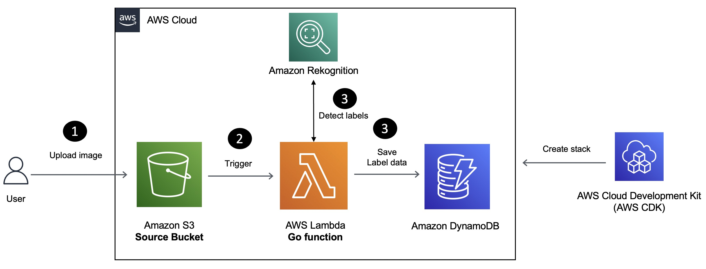

## Build a Serverless Application for Image Label Detection

In this tutorial, you will learn how to build a Serverless solution for image label detection using Amazon Rekognition, [AWS Lambda](https://aws.amazon.com/lambda/?sc_channel=el&sc_campaign=datamlwave&sc_content=label-detection-rekognition-lambda-golang&sc_geo=mult&sc_country=mult&sc_outcome=acq) and the [Go](https://go.dev/) programming language.

[Amazon Rekognition](https://docs.aws.amazon.com/rekognition/latest/dg/what-is.html?sc_channel=el&sc_campaign=datamlwave&sc_content=label-detection-rekognition-lambda-golang&sc_geo=mult&sc_country=mult&sc_outcome=acq) is a service that lets you analyze images and videos in your applications. You can identify objects, people, text, scenes, and activities, and detect inappropriate content. You can also do facial analysis, face comparison, and face search for various use cases like user verification and public safety. Amazon Rekognition is built on deep learning technology that doesn't require machine learning expertise to use. It has an easy-to-use API that can analyze any image or video file in [Amazon S3](https://docs.aws.amazon.com/AmazonS3/latest/userguide/Welcome.html?sc_channel=el&sc_campaign=datamlwave&sc_content=label-detection-rekognition-lambda-golang&sc_geo=mult&sc_country=mult&sc_outcome=acq).

Here is how the application works:

1. Images uploaded to [Amazon S3](https://docs.aws.amazon.com/AmazonS3/latest/userguide/Welcome.html?sc_channel=el&sc_campaign=datamlwave&sc_content=label-detection-rekognition-lambda-golang&sc_geo=mult&sc_country=mult&sc_outcome=acq) trigger a Lambda function.
2. The Lambda function extracts list of labels (with their name, category and confidence level) and saves it to an [Amazon DynamoDB](https://docs.aws.amazon.com/amazondynamodb/latest/developerguide/Introduction.html?sc_channel=el&sc_campaign=datamlwave&sc_content=label-detection-rekognition-lambda-golang&sc_geo=mult&sc_country=mult&sc_outcome=acq) table.

## Security

See [CONTRIBUTING](CONTRIBUTING.md#security-issue-notifications) for more information.

## License

This library is licensed under the MIT-0 License. See the LICENSE file.

